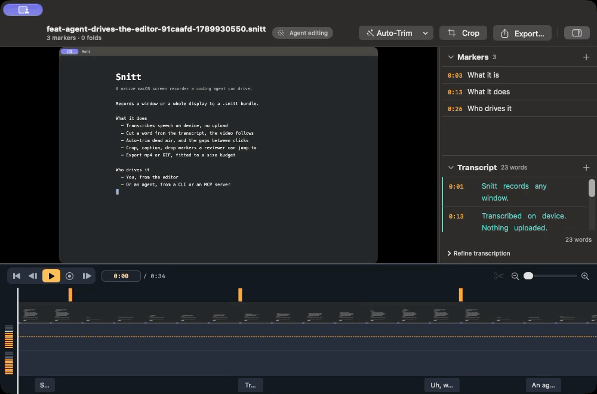

# Snitt

**A native macOS screen recorder that a coding agent can drive.**

Record a window, trim it, export it — in under a minute, from the menu bar or
from a script. Transcription runs on your Mac and the recording never leaves it.

*Snitt* is Swedish and Norwegian for **cut** — as in a film edit, or a
cross-section.



<sup>Recorded, edited, captioned and exported by an agent, using nothing but
`snitt` — including the recording of Snitt's own editor doing the cut. The
"Agent editing" badge beside the filename is the editor saying so.</sup>

> **Status: early.** v0.8.0 is signed, notarized and shipping, and it is used
> daily by the person who writes it. Interfaces still move. If you find a defect
> the honest place to look for what is already known is
> [`docs/superpowers/notes/field-notes.md`](docs/superpowers/notes/field-notes.md).

---

## Why this exists

macOS already has `Cmd+Shift+5`, which is free and pre-installed. Snitt has to
earn its place against that, and it does so through a **combination** rather
than any single feature:

- **An agent can drive it.** Claude Code or Codex can record a demo of a feature
  it just built and attach it to a pull request — over MCP or a CLI, with the
  same core the GUI uses. It can also drive **the editor**, so the editing is
  something a person can watch rather than something that happens to a file.
  The demo above was made that way, start to finish.
- **Transcription is on-device.** Speech never goes to a hosted service. Words
  carry timings, so you can click a word to seek, or select a phrase and delete
  it to cut those seconds.
- **Editing is focused, not a timeline suite.** Cuts, folds, crop, markers,
  chapters, per-track audio — the things you need before sharing, and not much
  more.
- **It is open source**, under the MPL, with no subscription.

Any one of those exists elsewhere. Together they do not.

## Requirements

- **macOS 26 (Tahoe)** or later
- Screen Recording permission — **granted once**, not monthly. macOS re-prompts
  apps that enumerate screen content themselves; Snitt goes through the system
  picker instead, which is what keeps that grant a one-time event.
- Microphone and Speech permissions only if you use them

## Install

```bash
brew tap impressiver/snitt
brew trust impressiver/snitt
brew install --cask snitt
```

The trust line is not optional: Homebrew refuses to load a cask from a
third-party tap until you say you meant to.

Or download the latest signed build from
[Releases](https://github.com/impressiver/snitt/releases), or build from source:

```bash
git clone https://github.com/impressiver/snitt.git
cd snitt
./Scripts/make-app.sh          # builds build/Snitt.app
open build/Snitt.app
```

Updates arrive in-app through Sparkle.

## Recording

**From the menu bar.** Click the status item, or press the global hotkey. The
system picker appears so you choose exactly what is captured — every time, by
design. No window opens while you record; the editor appears when you stop.

**From an agent.** Register the MCP server once:

```bash
snitt setup --apply
```

Then an agent can call `snitt_start_recording`, `snitt_mark`,
`snitt_stop_recording`, `snitt_export` and a couple of dozen more. Markers an
agent drops as it works become chapters in the exported video. It can read and
write the transcript too, so a recording with no microphone behind it can still
be captioned — an agent has no voice, so a written line is its microphone.

Every tool reports what it did rather than what it was asked to do, because an
agent cannot watch the screen. Nothing is ever guessed at: given two windows
and no window id, Snitt refuses rather than picking the larger one.

**From a shell.**

```bash
snitt targets list                                  # what can be recorded
snitt record start --app com.google.Chrome          # prints a session id
snitt record mark <session> --label "the bug"
snitt record stop <session>                         # prints the bundle path

snitt auto-deep-trim recording.snitt                # cut the dead air
snitt export recording.snitt --format mp4 --out demo.mp4 \
      --resolution 1080p --chapters
```

## Driving the editor

Everything above works headless. When you want the work to be **visible** —
filming a demo, or letting somebody watch — open the recording first and the
same verbs land in the window on screen:

```bash
snitt editor open recording.snitt --width 1000 --height 660
snitt editor seek   recording.snitt --to 24
snitt editor select recording.snitt --from 24 --to 26.5
snitt editor cut    recording.snitt
```

Each is one undo entry, so a person can take any of it back. While it happens
the editor shows an **"Agent editing"** badge beside the filename, because
nobody should have their timeline cut from under them without being told.

Only view state gets its own verbs — a playhead and a selection are not part of
the document. `trim`, `crop` and `narrate` are the same verbs as ever; open the
recording and they simply become visible. An agent may only open a recording an
agent made: putting somebody's recording on screen is a disclosure, and Snitt
will not make it on a caller's say-so.

`snitt --help` lists every verb. Output is JSON on stdout and human text on
stderr, so a script can parse one while a person reads the other.

## The `.snitt` document

A recording is a bundle, not a file. Inside it: the untouched capture, an edit
list, an event log, a transcript, and metadata. **Edits never touch the
capture** — trimming and cropping write to `edit.json`, so every edit is
reversible and the original is always there. Export renders the result.

Because the edit list is plain JSON beside the video, a script or an agent can
read and change an edit without going near the GUI. If the bundle happens to be
open in the editor, the edit is routed **through that window** rather than
written underneath it — one writer at a time, so the CLI and the GUI stay one
model instead of two.

## Privacy

- **Transcription is on-device.** Audio is never uploaded.
- **Input logging records keystroke *timing*, never the characters** — and is
  off by default. Timing alone can narrow a guess at what was typed, so the log
  stays inside the recording's bundle and is never sent anywhere.
- **The picker appears on every recording you start**, so nothing is ever
  captured that you did not just select.
- **An agent's recording skips the picker, and is gated instead.** It is off
  until you turn it on, it is limited to a single window unless you separately
  allow full-display capture, and the menu bar shows a live indicator with a
  stop button while it runs. Letting an agent record while nobody is watching
  is a further opt-in that **expires after 30 days** — a standing grant cannot
  know what the screen will be showing six weeks later.
- **No analytics, no telemetry.** The only network call Snitt makes is Sparkle
  checking for updates.

## Documentation

The [wiki](https://github.com/impressiver/snitt/wiki) covers installing,
recording, editing, exporting, privacy and the agent surface in more depth than
this page does.

## Contributing

See [`CONTRIBUTING.md`](CONTRIBUTING.md), and
[`docs/DEVELOPING.md`](docs/DEVELOPING.md) for environment setup and the traps
worth knowing before your first build.

Two things to know up front: every source file carries an MPL notice (a test
enforces it), and every test must name a plausible wrong implementation and be
verified to fail against it.

There is no CLA — sign your commits off with `git commit -s` instead. That
certifies you wrote the change, and submits it under both the MPL-2.0 and the
Apache-2.0, which is what lets the project relicense later without hunting down
every past contributor. You keep your copyright.
[`CONTRIBUTING.md`](CONTRIBUTING.md) has the detail.

## Design

Snitt is built from a written spec with a numbered decision log — every
non-obvious call, why it was made, and what evidence it rests on:
[`docs/superpowers/specs/2026-09-02-snitt-design.md`](docs/superpowers/specs/2026-09-02-snitt-design.md).

If you want to know why something works the way it does, that file almost
certainly says.

## Licence

[Mozilla Public License 2.0](LICENSE). File-level copyleft: changes to Snitt's
own files stay open, while a larger work that uses Snitt may carry its own
terms.

The source for every released build is this repository, and every release is
tagged. That sentence is the MPL §3.2 obligation being met rather than a
courtesy: distributing the app in executable form requires telling you where
the source is, and the same notice is in the About box.

Snitt bundles one third-party component, Sparkle, under the MIT licence. See
[`THIRD-PARTY-NOTICES.md`](THIRD-PARTY-NOTICES.md).
